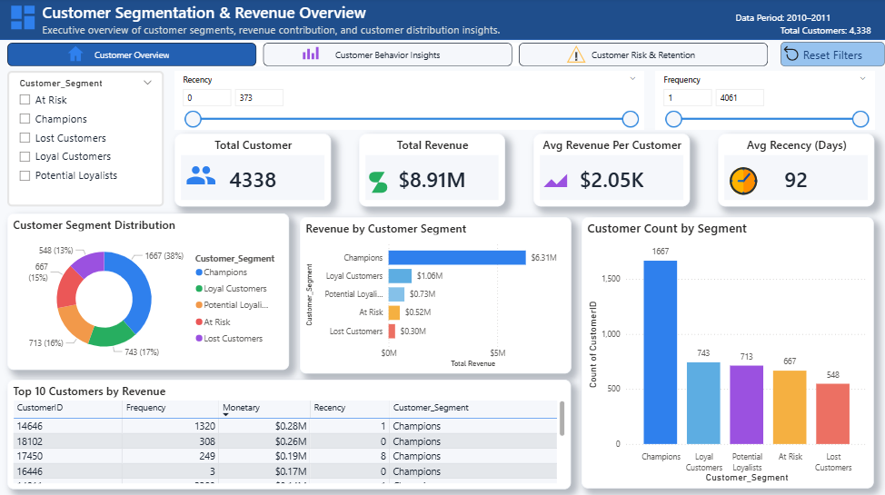
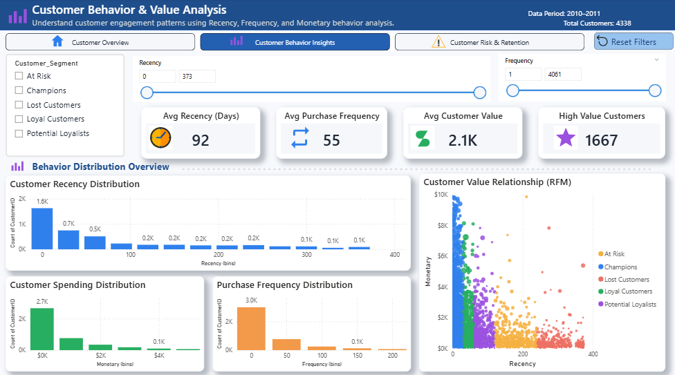
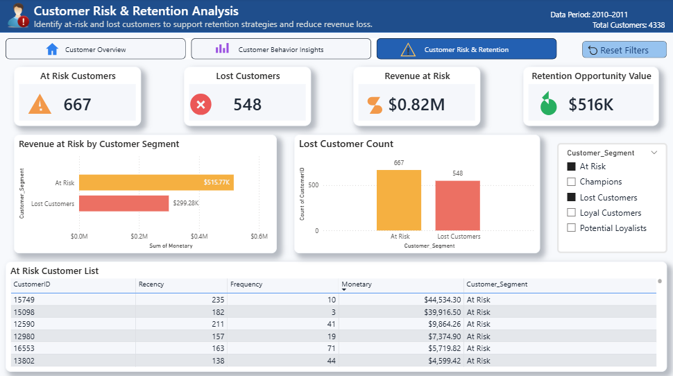

# 📊 Customer Segmentation & RFM Analysis Dashboard

## 📌 Project Overview

This project presents a **Customer Segmentation and RFM (Recency, Frequency, Monetary) Analysis Dashboard** built using **Power BI**.

The dashboard helps businesses understand customer behavior, identify high-value customers, and detect customers at risk of churn.

---

## 🎯 Business Objectives

* Identify **high-value customers**
* Analyze **customer purchase behavior**
* Detect **at-risk and lost customers**
* Support **customer retention strategies**
* Improve **revenue decision-making**

---

## 🧠 Key Concepts Used

* RFM Segmentation
* Customer Behavior Analysis
* Revenue Contribution Analysis
* Customer Retention Risk
* Data Visualization & Dashboard Design

---

## 🛠 Tools & Technologies

* Power BI
* Power Query
* DAX
* Microsoft Excel
* Data Modeling

---

## 📊 Dashboard Pages

### 1️⃣ Customer Overview

* Total Customers
* Total Revenue
* Average Revenue Per Customer
* Customer Segment Distribution
* Revenue by Customer Segment
* Top 10 Customers

---

### 2️⃣ Customer Behavior Insights

* Recency Distribution
* Frequency Distribution
* Monetary Distribution
* Customer Value Relationship (Scatter Plot)
* High Value Customer Analysis

---

### 3️⃣ Customer Risk & Retention

* At Risk Customers
* Lost Customers
* Revenue at Risk
* Retention Opportunity Value
* Lost Customer Analysis

---

## 📸 Dashboard Preview

### Customer Overview

---

### Customer Behavior Insights

---

### Customer Risk & Retention

---

## 📁 Dataset Information

* Source: Online Retail Dataset
* Domain: E-Commerce
* Data Type: Transactional Customer Data

---

## 📈 Skills Demonstrated

* Customer Segmentation
* RFM Analysis
* Data Cleaning
* Data Modeling
* DAX Measures
* Dashboard Design
* Business Intelligence

---

## 👨‍💻 Author

**Ajay Thakur**
Data Analyst | Power BI Developer

LinkedIn:
https://www.linkedin.com/in/ajay6469

GitHub:
https://github.com/ajay-data-analyst

